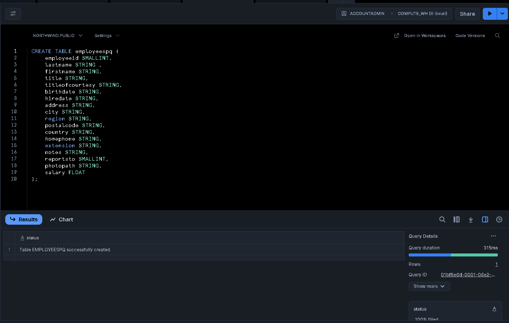
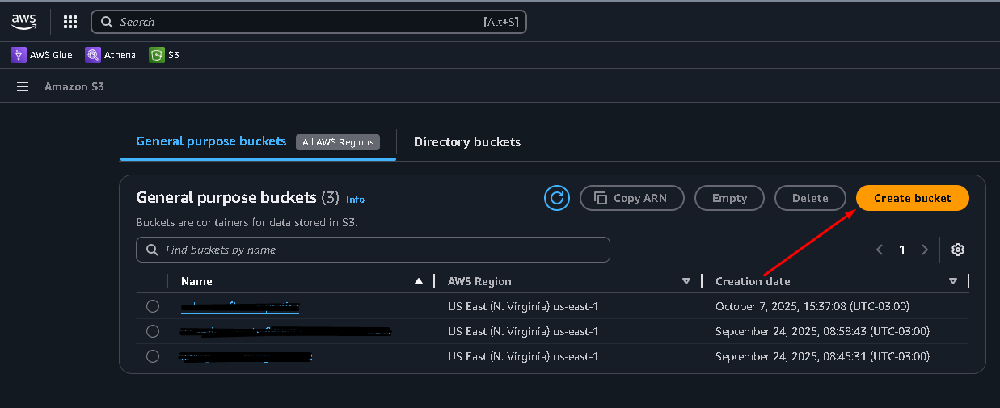
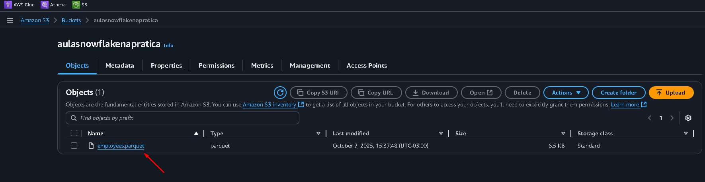

📘 Guia Rápido: S3 ➜ Snowflake com arquivo Parquet (employees.parquet)

 Snowflake: [text](https://www.snowflake.com/pt_br/)
 AWS: [text](https://aws.amazon.com/pt/?nc2=h_hom)
Este passo a passo ensina a criar a tabela no Snowflake, subir o arquivo no S3 e carregar os dados usando COPY INTO. 

✅ Pré-requisitos

Conta AWS com acesso ao S3.

Conta Snowflake com permissão para criar tabela e executar COPY INTO.

Arquivo employees.parquet pronto para upload.

1) Criar a tabela no Snowflake

Use exatamente o schema abaixo:

CREATE OR REPLACE TABLE employeespq (
    employeeid     SMALLINT,
    lastname       STRING,
    firstname      STRING,
    title          STRING,
    titleofcourtesy STRING,
    birthdate      STRING,
    hiredate       STRING,
    address        STRING,
    city           STRING,
    region         STRING,
    postalcode     STRING,
    country        STRING,
    homephone      STRING,
    extension      STRING,
    notes          STRING,
    reportsto      SMALLINT,
    photopath      STRING,
    salary         FLOAT
);

⚠️ Observação: birthdate e hiredate estão como STRING. Se quiser datas de fato, converta depois com TO_DATE.

2) Criar o bucket e enviar o arquivo ao S3

No AWS Console, abra S3.

Clique em Create bucket e defina um nome (ex.: qualquer nome).

Após criar, entre no bucket e clique em Upload.

Envie o arquivo employees.parquet.

Clique no arquivo enviado e copie o S3 URI (ex.:
s3://nomedoucket/employees.parquet).

3) Gerar as credenciais (Access Key e Secret)

No canto superior direito (seu usuário) → Security credentials.

Vá até Access keys → Create access key.

Guarde o Access Key ID e o Secret Access Key em local seguro.

Você não verá a Secret novamente após fechar a janela.

4) Carregar os dados no Snowflake (COPY INTO)

No worksheet do Snowflake, rode:

COPY INTO employeespq
FROM 's3://aulasnowflakenapratica/employees.parquet'
CREDENTIALS = (
  AWS_KEY_ID = '<COLE_SUA_ACCESS_KEY_ID_AQUI>'
  AWS_SECRET_KEY = '<COLE_SUA_SECRET_ACCESS_KEY_AQUI>'
)
FILE_FORMAT = (TYPE = 'PARQUET')
MATCH_BY_COLUMN_NAME = CASE_INSENSITIVE;

🔎 O MATCH_BY_COLUMN_NAME = CASE_INSENSITIVE faz o mapeamento de colunas por nome sem diferenciar maiúsculas/minúsculas.

5) Validar a carga
-- Quantidade de linhas
SELECT COUNT(*) FROM employeespq;

-- Amostra dos dados
SELECT * FROM employeespq;

Se as linhas aparecerem, a carga deu certo ✅

(Opcional) Converter datas depois da carga

Exemplo para normalizar birthdate e hiredate (se vierem como YYYY-MM-DD):

-- Criar novas colunas do tipo DATE (se desejar)
ALTER TABLE employeespq ADD COLUMN birthdate_dt DATE;
ALTER TABLE employeespq ADD COLUMN hiredate_dt DATE;

-- Popular convertendo de STRING para DATE
UPDATE employeespq
SET
  birthdate_dt = TRY_TO_DATE(birthdate, 'YYYY-MM-DD'),
  hiredate_dt  = TRY_TO_DATE(hiredate,  'YYYY-MM-DD');